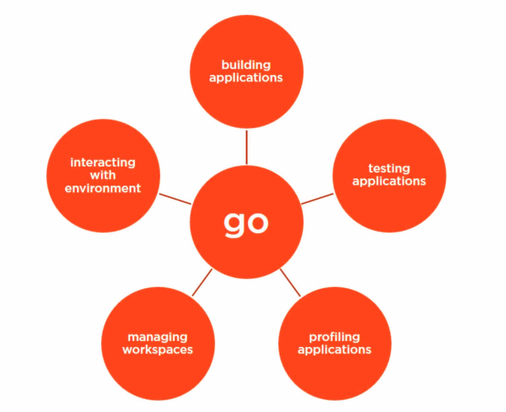

# Chapter 5 - The Go CLI Playbook

Source Reference: [The Go CLI Playbook](https://app.pluralsight.com/library/courses/go-cli-playbook/table-of-contents)

## 5.1 Introduction

> The Go Programming language is an open source project to make programmers **more productive.**
> [- Golag](https://golang.org)

The core focus is always on productivity. Go Programming language has these three core characteristics:

1. **Efficient:** Both compiled binaries and code are very efficient.
2. **Clean:** The syntax is very clean, very easy and have very few keywords.
3. **Expansive:** Having more line of code, each one having a more smaller but obvious responsibility is better than having
a more concise language that might take a little longer to learn.
   
## 5.2 The Go Command

The `go` command is the central hub for all the tasks we need to do with Go programs. We can do the below mentioned tasks
with the `go` command.

1. Building applications
2. Testing applications
3. Profiling applications
4. Managing workspaces
5. Interacting with environments

## 5.3 Building and Running Programs
## 5.4 Testing Programs
## 5.5 Managing Workspaces
## 5.6 Interacting with the environment